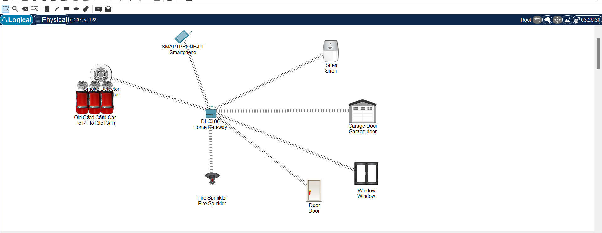
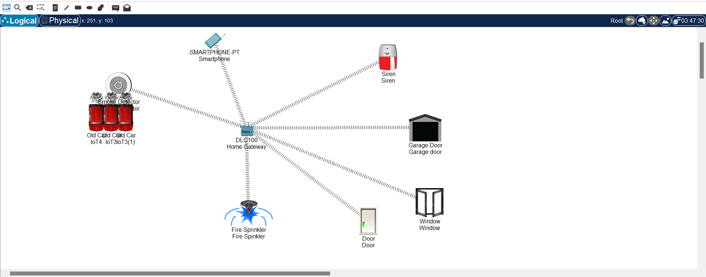
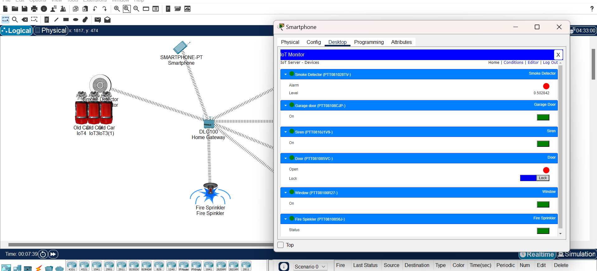

# Fire Detection IoT Simulation

This project demonstrates an IoT-based fire detection system using Cisco Packet Tracer. The simulation includes a car emitting smoke, which triggers connected IoT devices like a smoke detector, fire sprinkler, and alarms.

---

## **Project Overview**
- **Simulator:** Cisco Packet Tracer
- **Scenario:**
  - An old car emits smoke.
  - Smoke detector identifies the smoke.
  - Connected devices (fire sprinkler, siren) respond accordingly.
- **IoT Devices Used:**
  - Old IoT Car
  - Smoke Detector
  - Fire Sprinkler
  - Siren
  - Home Gateway

---

## **Snapshots**
1. **Initial Setup:**
   

2. **Smoke Detection in Action:**
   

3. **Fire Sprinkler and Alarm Triggered:**
   

---

## **How to Run**
1. Open the `project-name.pkt` file in Cisco Packet Tracer.
2. Start the simulation mode.
3. Observe the smoke from the car and the triggered devices.

---

## **Features**
- IoT integration with smoke detectors and automated responses.
- Real-time simulation of fire detection scenarios.

---

## **Contributors**
- **Your Name**
DIL ZAIB
